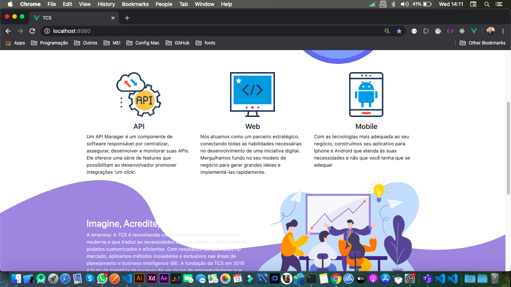

<h1 align="center">
    Design+Code
</h1>

<h4 align="center">
  Porfolio TCS
</h4>


<p align="center">
  <a href="#r">Technologies</a>&nbsp;&nbsp;&nbsp;|&nbsp;&nbsp;&nbsp;
  <a href="#">How To Use</a>&nbsp;&nbsp;&nbsp;
</p>

<p align="center">
  
</p>

## :rocket: Technologies

This project was developed with the following technologies:

-  [Vue](https://vuejs.org/)
-  [Lottie](https://pub.dev/packages/lottie)
-  [Adobe Ilustrator](https://www.adobe.com/br/products/illustrator.html?gclid=CjwKCAjwte71BRBCEiwAU_V9h9ultaeHR8DqUKZpDHCMU8Xb8kZGy6P55V2prv-wSqjlzZmXqTEmHxoCLWQQAvD_BwE&sdid=KQPNX&mv=search&ef_id=CjwKCAjwte71BRBCEiwAU_V9h9ultaeHR8DqUKZpDHCMU8Xb8kZGy6P55V2prv-wSqjlzZmXqTEmHxoCLWQQAvD_BwE:G:s&s_kwcid=AL!3085!3!301784431320!e!!g!!adobe%20illustrator)
-  [Adobe After Effects](https://www.adobe.com/br/products/illustrator.html?gclid=CjwKCAjwte71BRBCEiwAU_V9h9ultaeHR8DqUKZpDHCMU8Xb8kZGy6P55V2prv-wSqjlzZmXqTEmHxoCLWQQAvD_BwE&sdid=KQPNX&mv=search&ef_id=CjwKCAjwte71BRBCEiwAU_V9h9ultaeHR8DqUKZpDHCMU8Xb8kZGy6P55V2prv-wSqjlzZmXqTEmHxoCLWQQAvD_BwE:G:s&s_kwcid=AL!3085!3!301784431320!e!!g!!adobe%20illustrator)


## :information_source: How To Use

To clone and run this application, you'll need [Git](https://git-scm.com), on your computer. From your command line:

```bash
# Clone this repository
$ git clone https://github.com/eritondev-stack/portfolio-tcs.git

# Go into the repository
$ cd portfolio-pessoal

# Install dependencies
$ npm install

# Run the app 
$ npm run serve
```

Made with ♥ by Eriton Gomes :wave: [Get in touch!](https://www.linkedin.com/in/eriton-gomes-323713ba/)

[nodejs]: https://nodejs.org/
[yarn]: https://yarnpkg.com/
[vc]: https://code.visualstudio.com/
[vceditconfig]: https://marketplace.visualstudio.com/items?itemName=EditorConfig.EditorConfig
[vceslint]: https://marketplace.visualstudio.com/items?itemName=dbaeumer.vscode-eslint
